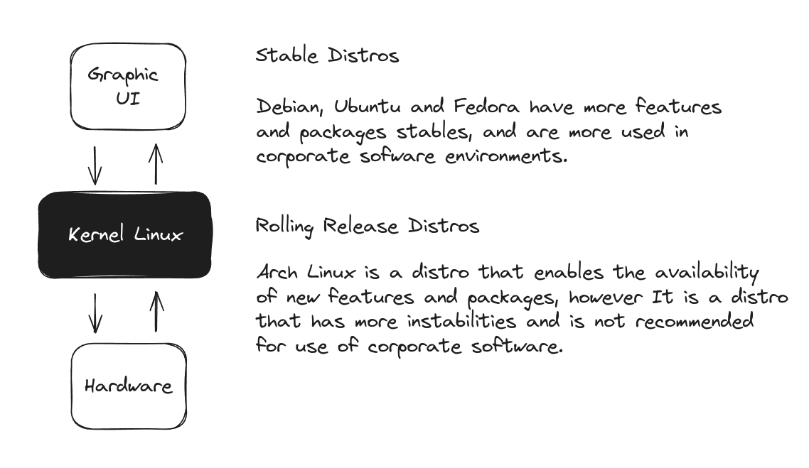

# Overview

This repository is dedicated to concentrate studies about software system and infrastructure management with linux.

Linux is a common and powerful OS which provides a great set of technologies to manage and host servers.

Main common distributions are:

- [Ubuntu](https://ubuntu.com/download)
- [Fedora](https://fedoraproject.org/)
- [Debian](https://www.debian.org/index.pt.html)
- [Arch Linux](https://archlinux.org/)

> and else more available flavors distros, used for specific workflow use cases such as audiovisual editing and etc...

## Linux Kernel, Stable and Rolling Release Distros

