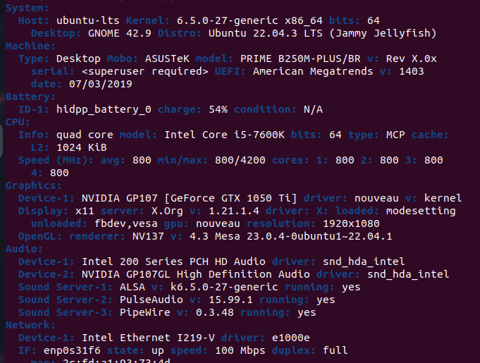

[Back to Start](../../README.md)

# Linux Hardware Specs

**Check complete system's and hardware specifications, in cases of cloud hardware upgrade and etc...**

Install package:

```
sudo apt install inxi -y
```

Run:

```
inxi -F
```

Output:


